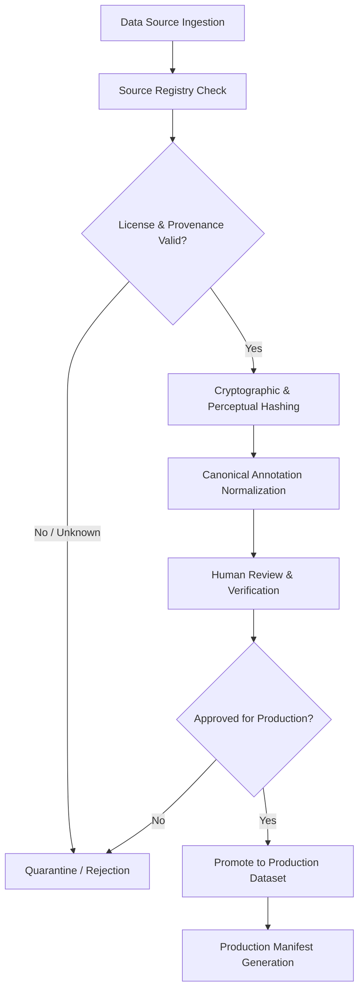

# Commercial Production Data Strategy

## 1. Overview & Core Invariants

JointInspect is engineered to solve pipe-joint assessment with zero artificial guessing. For commercial production readiness, our machine-learning dataset strategy operates under strict legal and ethical provenance rules:

1. **Zero Unverified Ingestion**: No dataset or image is permitted into the production training corpus without verified commercial rights.
2. **Sewer-ML Status (`BENCHMARK_PERMISSION_PENDING`)**:
   - The Sewer-ML academic dataset **MUST NOT** be used for production training, fine-tuning, pretraining, distillation, production RAG, embeddings, or production model weights.
   - It is marked `BENCHMARK_PERMISSION_PENDING` with `production_eligible = false` and `training_allowed = false`.
   - Its adapter remains strictly isolated in the benchmark evaluation harness.
3. **Fail-Closed Promotion Gate**:
   - Any source marked `UNKNOWN_RIGHTS` automatically implies `production_eligible = false` and `commercial_training_allowed = false`.
   - Suspected unauthorized mirrors or repackaged datasets (from Hugging Face, Roboflow, Kaggle, GitHub) are strictly quarantined and rejected from production training.
4. **Authoritative Measurement Separation**:
   - Machine learning models (Model A for joint localization, Model B for joint condition classification) provide visual suggestions.
   - Physical millimetre gap measurements are derived deterministically using calibrated OpenCV algorithms. RAG provides advisory information and never alters physical measurements.

---

## 2. GCS & Staging Directory Structure

All training assets are organized in Google Cloud Storage (`gs://joint-inspection-510310-data`) and mirrored in local development staging:

```
gs://joint-inspection-510310-data/datasets/
├── quarantine/                          # Staging area for initial audit & duplicate checks
│   └── quarantine_index.json
├── production/                          # Authoritative commercial training corpus
│   └── jointinspect-v1/
│       ├── manifests/                   # Immutable JSON manifests with SHA256 signatures
│       ├── images/                      # RGB assets
│       ├── annotations/                 # Canonical normalized masks & bounding boxes
│       ├── splits/                      # Leakage-free train / val / test splits
│       ├── provenance/                  # Legal contracts, licenses, and receipts
│       ├── licenses/                    # Full-text licenses
│       └── reviews/                     # Human review event logs
├── synthetic/                           # Parametric synthetic dataset with known ground truth
│   └── jointinspect-synthetic-v1/
├── owned-real/                          # Project-owned test rig & inspection assets
├── partner-data/                        # Commercial partner inspection footage with written rights
└── benchmarks/                          # Frozen benchmark datasets (strictly isolated from training)
    └── sewerml/
        └── permission-pending/
```

---

## 3. Data Ingestion Lifecycle



1. **Hash Verification**: Every asset receives an exact cryptographic SHA-256 hash and a 64-bit difference perceptual hash (`dHash`) to detect exact and near-duplicates.
2. **Provenance & License Audit**: Detects non-commercial clauses (`CC-NC`, academic-only) and viral copyleft restrictions (`GPL`, `CC-BY-SA`).
3. **Quarantine Staging**: Raw files are staged in `quarantine/` until all programmatic checks pass.
4. **Human Review**: Ambiguous annotations, bounding boxes, and condition classes are verified in the internal annotation interface.
5. **Fail-Closed Promotion**: Only assets where `commercial_training_allowed == true` and `production_eligible == true` are promoted to production manifests.
